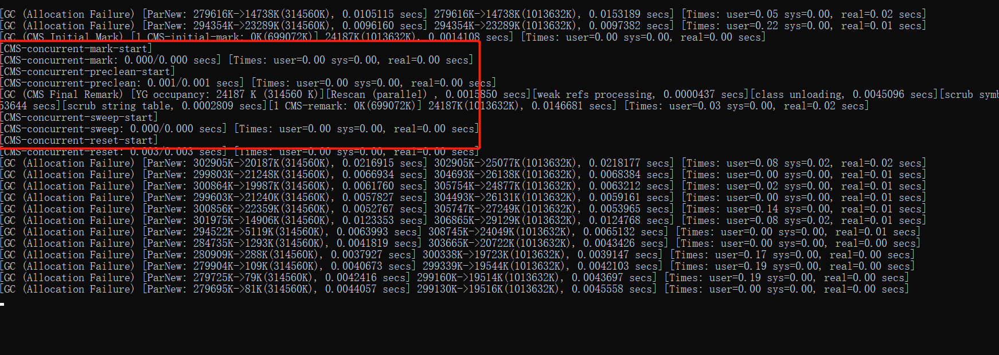
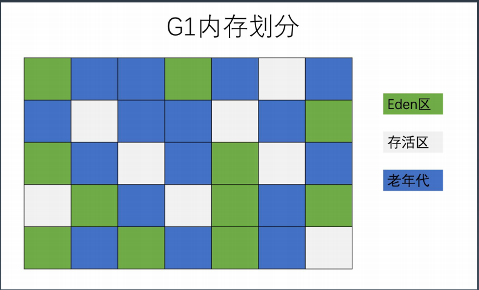
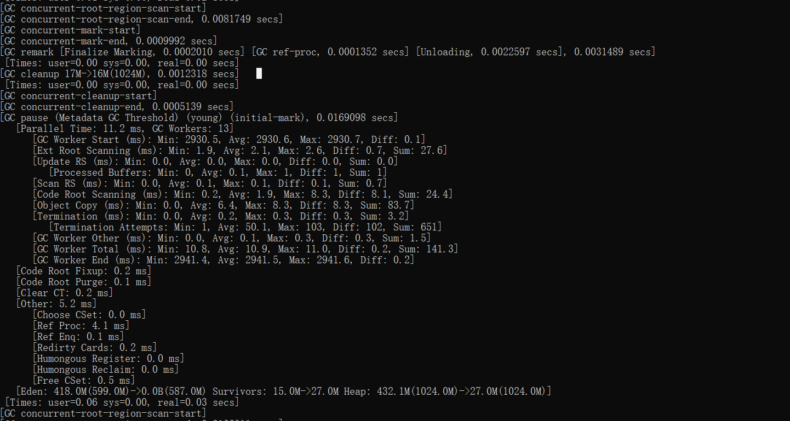
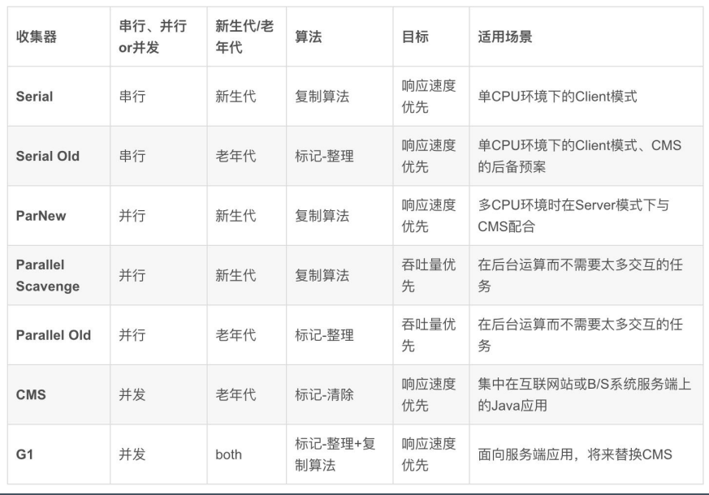
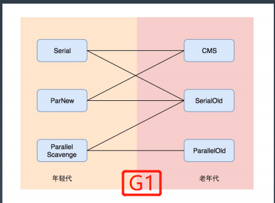

#GC对象引用标记
    1、引用计数法 简单粗暴 无法解决循环引用问题
    2、GC Root可达性算法
        可作为GC Root的对象
        -当前正在执行的方法里的局部变量和 输入参数
        -活动线程
        -所有类的静态字段
        -JNI引用
        此阶段暂停的时间，与堆内存大小,对象 的总数没有直接关系，
        而是由存活对象 （alive objects）的数量来决定。
        所以增加堆内存的大小并不会直接影响标记阶段 占用的时间
        
#GC算法
    1、标记-清除（Mark-Sweep）
        两个不足：
            -标记和清除效率都不高
            -清除后空间不连续，碎片多，后续大对象可能在内存足够却无足够的连续空间无法分配
    2、标记-复制（Mark-Copy）
        不会产生碎片 实现简单高效 内存利用率低
    3、标记-清除-整理（Mark-Sweep-Compact）
#垃圾收集器
    1、串行 GC（Serial GC）
        -XX:+UseSerialGC 配置串行 GC
        串行 GC 对年轻代使用 mark-copy（标记-复制） 算法，对老年代使用 mark-sweep- compact（标记-清除-整理）算法
    2、并行 GC（Parallel GC）
        -XX:+UseParallelGC 
        -XX:+UseParallelOldGC 
        -XX:+UseParallelGC -XX:+UseParallelOldGC
        在年轻代使用 标记-复制（mark-copy）算法，在老年代使用 标记-清除-整理（mark-sweep- compact）算法。 
        -XX：ParallelGCThreads=N 来指定 GC 线程数， 其默认值为 CPU 核心数。
    3、并发CMS Mostly Concurrent Mark and Sweep Garbage Collector
        -XX:+UseConcMarkSweepGC
        其对年轻代采用并行 STW 方式的 mark-copy (标记-复制)算法，对老年代主要使用并发 mark-sweep (标记-清除)算法。
        CMS 使用的并发线程数等于 CPU 核心数的 1/4
        思考：并行 Parallel 与并发 Concurrent 的区别？
        - 并行指多个线程并行收集垃圾，暂停所有用户线程STW
        - 并发指垃圾收集器与用户线程同时执行
        CMS 六个阶段
        阶段 1: Initial Mark（初始标记） 
        阶段 2: Concurrent Mark（并发标记） 
        阶段 3: Concurrent Preclean（并发预清理） 
        阶段 4: Final Remark（最终标记） 
        阶段 5: Concurrent Sweep（并发清除） 
        阶段 6: Concurrent Reset（并发重置）

        CMS 也有一些缺点，其中最大的问题就是老 年代内存碎片问题（因为不压缩）
        4、G1GC
        -XX:+UseG1GC -XX:MaxGCPauseMillis=50
        -XX：+UseG1GC：启用 G1 GC；
        -XX：G1NewSizePercent：初始年轻代占整个 Java Heap 的大小，默认值为 5%； 
        -XX：G1MaxNewSizePercent：最大年轻代占整个 Java Heap 的大小，默认值为 60%； 
        -XX：G1HeapRegionSize：设置每个 Region 的大小，单位 MB，需要为 1，2，4，8，16，32 中的某个值，默 认是堆内存的 1/2000。如果这个值设置比较大，那么大对象就可以进入 Region 了。
        -XX：ConcGCThreads：与 Java 应用一起执行的 GC 线程数量，默认是 Java 线程的 1/4，减少这个参数的数值 可能会提升并行回收的效率，提高系统内部吞吐量。如果这个数值过低，参与回收垃圾的线程不足，也会导致并行 回收机制耗时加长。
        -XX：+InitiatingHeapOccupancyPercent（简称 IHOP）：G1 内部并行回收循环启动的阈值，默认为 Java Heap 的 45%。这个可以理解为老年代使用大于等于 45% 的时候，JVM 会启动垃圾回收。这个值非常重要，它决定了 在什么时间启动老年代的并行回收。 
        -XX：G1HeapWastePercent：G1停止回收的最小内存大小，默认是堆大小的 5%。GC 会收集所有的 Region 中 的对象，但是如果下降到了 5%，就会停下来不再收集了。就是说，不必每次回收就把所有的垃圾都处理完，可以 遗留少量的下次处理，这样也降低了单次消耗的时间。 
        -XX：G1MixedGCCountTarget：设置并行循环之后需要有多少个混合 GC 启动，默认值是 8 个。老年代 Regions的回收时间通常比年轻代的收集时间要长一些。所以如果混合收集器比较多，可以允许 G1 延长老年代的 收集时间
        息，每个 Region 里的对象存活信息。 -XX：G1ReservePercent：G1 为了保留一些空间用于年代之间的提升，默认值是堆空间的 10%。因为大量执行回收的地方 在年轻代（存活时间较短），所以如果你的应用里面有比较大的堆内存空间、比较多的大对象存活，这里需要保留一些内存。 
        -XX：+G1SummarizeRSetStats：这也是一个 VM 的调试信息。如果启用，会在 VM 退出的时候打印出 Rsets 的详细总结信息。 
        -XX:G1SummaryRSetStatsPeriod 参数，就会阶段性地打印 Rsets 信息。 
        -XX：+G1TraceConcRefinement：这个也是一个 VM 的调试信息，如果启用，并行回收阶段的日志就会被详细打印出来。 
        -XX：+GCTimeRatio：这个参数就是计算花在 Java 应用线程上和花在 GC 线程上的时间比率，默认是 9，跟新生代内存的 分配比例一致。这个参数主要的目的是让用户可以控制花在应用上的时间，G1 的计算公式是 100/（1+GCTimeRatio）。这 样如果参数设置为 9，则最多 10% 的时间会花在 GC 工作上面。Parallel GC 的默认值是 99，表示 1% 的时间被用在 GC 上 面，这是因为 Parallel GC 贯穿整个 GC，而 G1 则根据 Region 来进行划分，不需要全局性扫描整个内存堆。 
        -XX：+UseStringDeduplication：手动开启 Java String 对象的去重工作，这个是 JDK8u20 版本之后新增的参数，主要用 于相同 String 避免重复申请内存，节约 Region 的使用。
        -XX：MaxGCPauseMills：预期 G1 每次执行 GC 操作的暂停时间，单位是毫秒，默认值是 200 毫秒，G1 会尽量保证控制 在这个范围内        
        堆不再分成年轻代和老年代，而是划分为多 个（通常是 2048 个）可以存放对象的 小块堆区 域(smaller heap regions)。
        每个小块，可能一会 被定义成 Eden 区，一会被指定为 Survivor区或者 Old 区。
        在逻辑上，所有的 Eden 区和 Survivor 区合起来就是年轻代，所有的 Old 区拼在一起那 就是老年代

    
        特别需要注意的是，某些情况下 G1 触发了 Full GC，这时 G1 会退化使用 Serial 收集器来完成垃圾的清理工作， 它仅仅使用单线程来完成 GC 工作，GC 暂停时间将达到秒级别的。 
        1.并发模式失败 G1 启动标记周期，但在 Mix GC 之前，老年代就被填满，这时候 G1 会放弃标记周期。
            解决办法：增加堆大小， 或者调整周期（例如增加线程数-XX：ConcGCThreads 等）。 
        2.晋升失败 没有足够的内存供存活对象或晋升对象使用，由此触发了 Full GC(to-space exhausted/to-space overflow）。 
            解决办法：
            a) 增加 –XX：G1ReservePercent 选项的值（并相应增加总的堆大小）增加预留内存量。 
            b) 通过减少 –XX：InitiatingHeapOccupancyPercent 提前启动标记周期。 
            c) 也可以通过增加 –XX：ConcGCThreads 选项的值来增加并行标记线程的数目。 
        3.巨型对象分配失败 当巨型对象找不到合适的空间进行分配时，就会启动 Full GC，来释放空间。 
            解决办法：增加内存或者增大 -XX：G1HeapRegionSize

#GC算法选择
    唯一可行的方式就是去尝试，一般性的指导原则： 
    1. 如果系统考虑吞吐优先，CPU 资源都用来最大程度处理业务，用 Parallel GC； 
    2. 如果系统考虑低延迟有限，每次 GC 时间尽量短，用 CMS GC； 
    3. 如果系统内存堆较大，同时希望整体来看平均 GC 时间可控，使用 G1 GC。 
    对于内存大小的考量： 
        1. 一般 4G 以上，算是比较大，用 G1 的性价比较高。 
        2. 一般超过 8G，比如 16G-64G 内存，非常推荐使用 G1 GC。 
    最后讨论一个很多开发者经常忽视的问题，也是面试大厂常问的问题：JDK8 的默认 GC 是什么？ JDK9，JDK10，JDK11…等等默认的是 GC 是什么？
    JDK8 ParallelGC
    JDK9 G1
    JDK11 ZGC
    