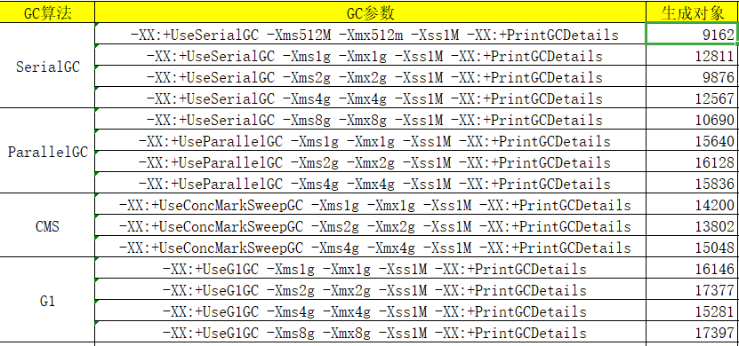

# GC调优
   - 针对GC调优需要具体场景具体处理，脱离场景谈调优都是耍流氓
   - 根据具体场景选择合适的GC算法以及对应的参数
## 制定GC性能指标
三个通用指标
   - Latency(延迟)
     
     响应时间必须控制在多少以内?
     监控GC STW时间是否满足
     可以设置-XX:MaxGCPauseMillis=<N>
   - Throughput(吞吐量)
     
      系统每天或者每小时需要处理多少请求？
     
      为了保证吞吐量需要考虑GC总时间必须在一定范围
      吞吐量:吞吐量为垃圾回收时间与非垃圾回收时间的比值，通过-XX:GCTimeRatio=<N>来设定，公式
     为1/（1+N）。例如，-XX:GCTimeRatio=19时，表示5%的时间用于垃圾回收。默认情况为99，即
     1%的时间用于垃圾回收。
   - Capacity(系统容量)
     
      在满足延迟和吞吐量的前提下达到使用尽可能少的资源
## GC调优步骤
   - 列出性能调优指标(State your performance goals) 
   - 调整GC算法或者参数执行测试(Run tests) 
   - 检查结果(Measure the results) 
   - 与目标进行对比(Compare the results with the goals) 
   - 如果达不到指标, 继续修改配置参数, 然后继续测试(go back to running tests)

## 不同GC算法示例总结

-Xmx大小的选择理因根据业务需求选择
   过大会导致每次GC时间过长
   过小可能会导致OOM
- SerialGC
    
   延迟高、吞吐量低
  --适用情况：数据量比较小（100M左右）；单处理器下并且对响应时间无要求的应用。
  --缺点：只能用于小型应用
- ParallelGC 

  吞吐量高、 延迟时间较长
  适用于对吞吐量要求高的场景
  
- CMS

  老年代并发收集.延迟低
  测试数据均不如ParallelGC 可能是因为FGC次数少，体现不出老年代并发收集的优势
  
- G1GC

  延迟低、吞吐量高
  觉得在内存大于4G的情况尽量适用G1GC

##分配速率
##提升速率
##