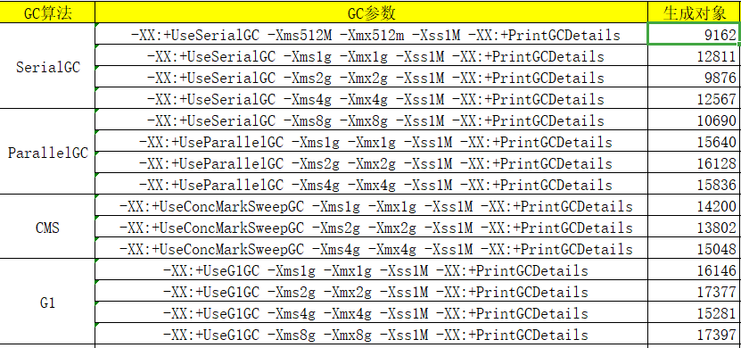

# Week02作业题目

##【周三作业题目】
1. 使用 GCLogAnalysis.java 自己演练一遍串行 / 并行 /CMS/G1 的案例。
   
2. 使用压测工具（wrk 或 sb），演练 gateway-server-0.0.1-SNAPSHOT.jar 示例。
3. （选做） 如果自己本地有可以运行的项目，可以按照 2 的方式进行演练。
4. （必做） 根据上述自己对于 1 和 2 的演示，写一段对于不同 GC 的总结，提交到 Github。
##【周日作业题目】
1. （选做）运行课上的例子，以及 Netty 的例子，分析相关现象。
2. （必做）写一段代码，使bb用 HttpClient 或 OkHttp 访问 http://localhost:8801。
